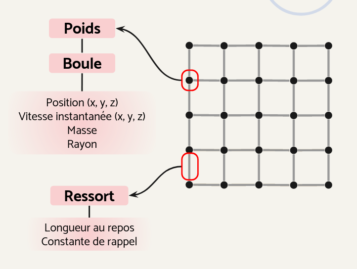
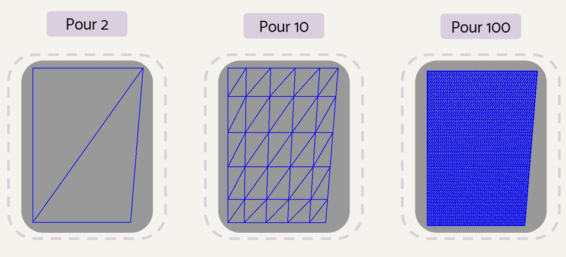
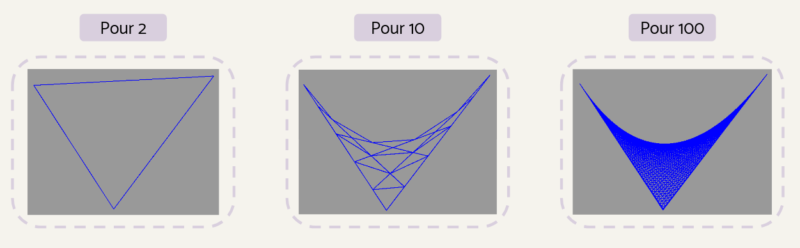
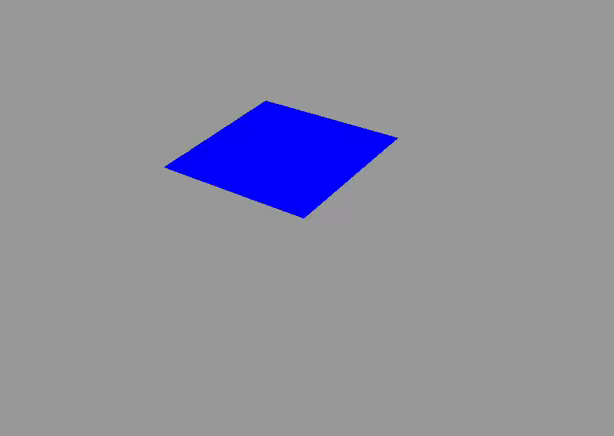
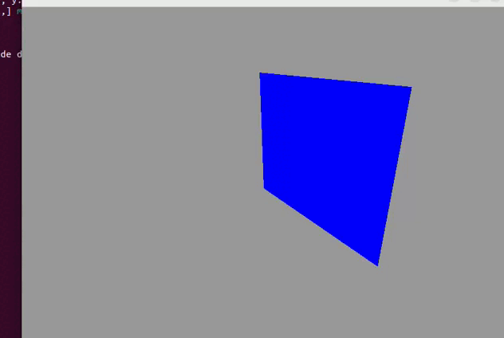

# Simulation-de-tissus

Projet de simulation de tissus en 3D soumis à des forces internes (ressorts) et des forces externes telles que le vent et la résistance d'un fluide dans lequel le tissu se déplace. Le but de ce projet est d'implémenter une représentation "réaliste" d'un tissu en utilisant OpenGL et GL4D (OpenGL Shading Language). L'application permettra de visualiser la simulation, offrant ainsi une représentation graphique du comportement du tissu en temps réél. (Pas de collisions pour le moment)

## Bibliothèques utilisées

### Json
* [cJSON](https://github.com/DaveGamble/cJSON): Une bibliothèque en langage C pour la création et la lecture de fichiers JSON.

### Affichage
-   [GL4D](https://gl4d.api8.fr/FR/): Une bibliothèque en langage C basée sur OpenGL pour faciliter la création d'applications graphiques 2D et 3D.
-   [OpenGL](https://www.opengl.org/): Une spécification et une API (Application Programming Interface) pour la création d'applications graphiques 2D et 3D. Elle fournit des fonctionnalités avancées pour la programmation graphique, y compris la gestion des shaders, des textures, des lumières, etc.
## Fonctionnement
### Définition du modèle
Le modèle de représentation pour notre tissu correspond à un ensemble de poids et de ressorts qui les relient entre eux. Ainsi, nous pourrons calculer les forces appliquées à chaque poids qui a une masse, une position et une vitesse instantanée. Cela permet de limiter le nombre de calculs nécessaires. L'ajout des ressorts permet de modéliser les forces internes du tissu, telles que son élasticité et son épaisseur. Cette approche nous permet d'obtenir des simulations précises et réalistes du comportement du tissu.



### Comment compiler l'application?

Après avoir installé GL4D, suivez les étapes ci-dessous :

1.  Exécutez la commande `$ make` pour compiler l'application.
2.  Lancez l'application en utilisant l'une des deux options suivantes :
    -   `$ ./simulation` : cela lancera l'application avec un modèle par défaut.
    -   `$ ./simulation env modele TX TY` : cela lancera l'application avec des paramètres spécifiques. Les paramètres sont les suivants :
        -   `env` : le fichier JSON qui définit votre environnement pour la simulation.
        -   `modele` : le fichier JSON dans lequel vous définissez votre tissu.
        -   `TX` : la taille du maillage en X.
        -   `TY` : la taille du maillage en Y.
    
    Par exemple, pour lancer l'application avec les fichiers `env.json` et `modele.json`, et une taille de maillage de 100x100, utilisez la commande suivante : `$ ./simulation modeles/env.json modeles/modele.json 100 100`

### Contrôles

   -  Mode Filaire : Appuyez sur la touche W pour passer en mode filaire. Cela affichera le modèle en utilisant un rendu filaire, montrant les arêtes et les contours du tissus.

   -  Switch de vues : Cliquez sur la touche V pour basculer entre les différentes vues que j'ai créées. Cela vous permettra d'explorer différents angles et perspectives du modèle.

Assurez-vous d'avoir l'application en cours d'exécution et active pour que les touches fonctionnent correctement.

### Créé ses propre modèles

Vous pouvez créer vos propres modèles et les afficher avec mon programme en respectant plusieurs règles :

#### Environnement

C'est le plus simple. Voici un exemple de structure JSON pour définir l'environnement :
```
	{
   		 "delta_t_": 0.1,
   		 "forces_exterieures": {"x": 0, "y": 0, "z": 0},
    		"viscosite": 0.5
	}
```

-   `delta_t_` : représente l'écart de temps entre chaque image calculée. Nous utilisons le schéma d'Euler pour calculer les positions de chaque poids.
-   `forces_exterieures` : indique la somme des forces que vous souhaitez appliquer au modèle, comme des forces dues au vent par exemple. Ces forces s'appliquent à l'ensemble du modèle.
-   `viscosite` : correspond à la viscosité du fluide dans lequel le modèle se déplace.

Lorsque vous créez vos propres modèles, veillez à respecter ces règles et à définir les valeurs appropriées pour chaque paramètre de l'environnement.

#### Pour le tissus 
La définition du tissu est un peu plus complexe. Voici un exemple de structure JSON :
```
 {
  "taille_x": 2,
  "taille_y": 2,
  "rayon_poids": 0.1,
  "tableau": [
  				{"position":{ "x": 0, "y": 0, "z": 1 }, "vitesse_instantanee":{ "x": 0, "y": 0, "z": 0 }, "masse": 0.5},
  				{"position":{ "x": 0, "y": 1, "z": 1 }, "vitesse_instantanee":{ "x": 0, "y": 0, "z": 0 }, "masse": 0.5},
  				{"position":{ "x": 1, "y": 0, "z": 1 }, "vitesse_instantanee":{ "x": 0, "y": 0, "z": 0 }, "masse": 0.5},
               {"position":{ "x": 1, "y": 1, "z": 1 }, "vitesse_instantanee":{ "x": 0, "y": 0, "z": 0 }, "masse": 0.5}
			 ]
,
  "tableau_ressorts": [[0, 1],[0, 2],[1, 3], [2, 3]],
  "taille_tableau_ressorts": 4,
  "k": 20.0,
  "longueur_ressorts_repos": 1.0,
  "liste_index_poids_fixes": [2, 1],
  "nb_poids_fixes": 2
}
```

Explications des différentes clés de la structure :

-   `taille_x` et `taille_y` : correspondent aux dimensions du tissu en x et y.
-   `rayon_poids` : représente le rayon des poids.
-   `tableau` : contient les informations pour chaque poids du tissu. Chaque poids a une position, une vitesse instantanée et une masse. Il est important de garder l'ordre des points, par exemple, définissez le tissu de haut à gauche au bas à droite.
-   `tableau_ressorts` : définit les relations entre les poids du tissu. Chaque élément de la liste contient deux index correspondant aux poids reliés par un ressort. L'ordre dans cette liste est libre.
-   `taille_tableau_ressorts` : représente la taille de la liste `tableau_ressorts`.
-   `k` : représente la constante de raideur des ressorts.
-   `longueur_ressorts_repos` : correspond à la longueur de repos des ressorts.
-   `liste_index_poids_fixes` : indique les indices des poids fixes dans le tissu.
-   `nb_poids_fixes` : représente le nombre de poids fixes.

Lorsque vous créez vos propres modèles de tissu, veillez à respecter la structure JSON et à fournir les valeurs appropriées pour chaque paramètre.

### Affichage et optimisation

Pour l'affichage du tissu, nous utilisons un maillage GL4D. Les positions et vitesses calculées en C sont envoyées au vertex shader afin de modifier la position des points du maillage. Ci-dessous, vous pouvez voir une représentation simplifiée du tissu avec des triangles :




Nous utilisons le vertex shader pour modifier les positions des points du maillage. Pour transmettre les données, nous avons choisi de les encapsuler dans une texture. Voici les raisons de ce choix :

-   Enregistrement facile dans les canaux RGB : En utilisant une texture, nous pouvons stocker les données de manière simple en utilisant les canaux de couleur (rouge, vert, bleu).
-   Rapidité de modification : L'utilisation d'une texture nous permet de modifier rapidement les données des coordonnées.
-   Possibilité d'envoyer plus de données qu'avec un uniforme : Les textures nous permettent de stocker et d'envoyer de grandes quantités de données, ce qui est particulièrement utile dans notre cas.
-   Interpolation bilinéaire automatique : L'interpolation bilinéaire automatique nous permet de calculer des points intermédiaires entre les poids définis dans le GPU. Cela permet de créer des transitions en douceur entre les positions.

L'interpolation bilinéaire fonctionne en calculant une moyenne pondérée des pixels voisins. Dans notre cas, cela permet de mieux représenter les courbes et d'améliorer l'aspect général du tissu en ajoutant des triangles de manière plus efficace.

#### Quels sont les avantages du calcul dans le GPU ?

Tout d'abord, le GPU (Graphics Processing Unit) est spécialement conçu pour le traitement graphique. Contrairement au CPU, il est optimisé pour exécuter des calculs parallèles. Nous exploitons ces propriétés pour calculer de nombreuses positions intermédiaires qui semblent réalistes et logiques dans nos modèles. Le GPU permet de traiter ces calculs massivement parallèles de manière efficace, ce qui améliore les performances et la qualité de notre rendu graphique.

Voici un schéma illustrant un tissu plié avec uniquement 4 points calculés en CPU et des tailles de maillages différentes (donc plus de points calculés par interpolation en GPU) :



En résumé, en utilisant une texture et en exploitant les capacités de calcul parallèle du GPU, nous parvenons à obtenir des transitions en douceur entre les positions, améliorant ainsi la qualité visuelle de notre tissu. De plus, le GPU offre une puissance de calcul significative pour traiter efficacement ces opérations.

## Images




